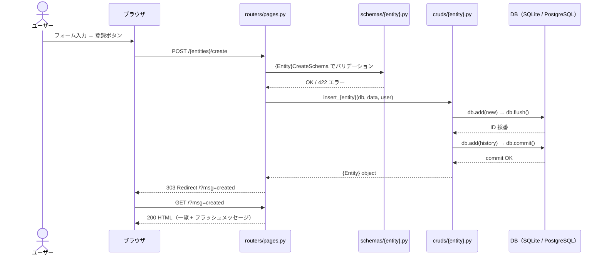
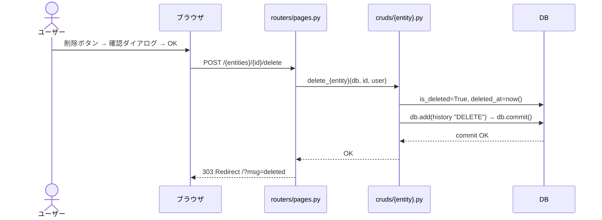
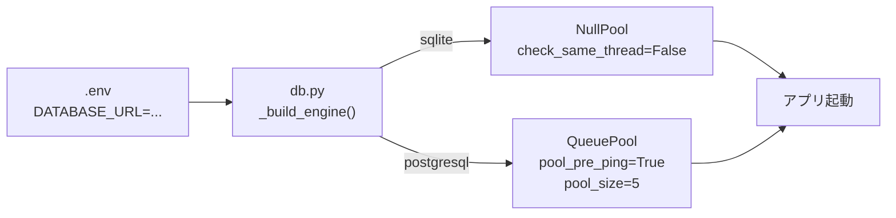

# 仕様書

| 項目 | 内容 |
| --- | --- |
| 作成日 | YYYY-MM-DD |
| 最終更新日 | YYYY-MM-DD |
| 版数 | v1.0 |
| 作成者 | （名前） |
| 関連文書 | 要件定義書 v1.0 |

---

## 1. システム概要

（要件定義書の目的・概要を 2〜3 文で要約。「何を作るか」を明確に）

---

## 2. 技術スタック

| 区分 | 技術 | バージョン |
| --- | --- | --- |
| 言語 | Python | 3.12 以上 |
| Web フレームワーク | FastAPI | 0.115 以上 |
| テンプレートエンジン | Jinja2 | 3.1 以上（SSR） |
| ORM | SQLAlchemy | 2.x 非同期モード |
| バリデーション | Pydantic | v2 |
| DB（開発） | SQLite + aiosqlite | - |
| DB（本番） | PostgreSQL + asyncpg | - |
| 設定管理 | python-dotenv | - |
| パッケージ管理 | uv | - |

---

## 3. ファイル構成

```text
{アプリ名}/
├── main.py               # アプリ起動・ミドルウェア・ルーター登録
├── config.py             # 設定管理（.env 読み込み）
├── db.py                 # DB エンジン・セッション（SQLite/PostgreSQL 自動切替）
├── init_database.py      # テーブル初期化スクリプト
├── pyproject.toml        # 依存パッケージ定義
├── .env                  # 環境設定（git 管理外）
├── .env.example          # 環境設定テンプレート
│
├── models/               # SQLAlchemy モデル（テーブル定義）
│   └── {テーブル名}.py
│
├── schemas/              # Pydantic スキーマ（入出力バリデーション）
│   └── {テーブル名}.py
│
├── cruds/                # DB 操作ロジック
│   └── {テーブル名}.py
│
├── routers/              # エンドポイント定義
│   ├── {テーブル名}.py   # REST API
│   └── pages.py          # Jinja2 ページ
│
├── templates/            # HTML テンプレート
│   ├── base.html
│   ├── index.html
│   └── edit.html
│
└── static/
    └── styles.css
```

---

## 4. ER 図（データベース設計）

```mermaid
erDiagram
    {テーブル名} {
        int id PK
        string {カラム名}
        bool is_deleted
        datetime deleted_at
        datetime created_at
        datetime updated_at
        string created_by
        string updated_by
    }
    {テーブル名}_histories {
        int id PK
        int {テーブル名}_id FK
        string operation
        datetime operated_at
        string operated_by
        string {カラム名スナップショット}
    }
    {テーブル名} ||--o{ {テーブル名}_histories : "1 to many"
```

> **テーブルが複数ある場合は erDiagram ブロック内に追加する。**
> **operation カラムの値は "CREATE" / "UPDATE" / "DELETE" の3種類。**

---

## 5. スキーマ定義（Pydantic）

```text
{Entity}CreateSchema        ← 登録リクエスト用
  {フィールド名}: {型}  必須 / 任意  バリデーション条件

{Entity}UpdateSchema        ← 更新リクエスト用（全フィールド Optional）
  {フィールド名}: {型} | None

{Entity}Schema              ← レスポンス用（DB の値を含む）
  id: int
  {フィールド名}: {型}
  created_at: datetime
  created_by: str
  ※ is_deleted / deleted_at は含めない

{Entity}HistorySchema       ← 履歴レスポンス用
  id: int
  {entity}_id: int
  operation: str
  operated_at: datetime
  operated_by: str

ResponseSchema              ← 操作結果（message のみ）
  message: str
```

---

## 6. API エンドポイント一覧

ベース URL（開発）: `http://localhost:8000`

### REST API（JSON）

| メソッド | パス | 処理 | 成功時 | エラー |
| --- | --- | --- | --- | --- |
| GET | `/api/{entities}/` | 一覧取得 | 200 | - |
| POST | `/api/{entities}/` | 新規登録 | 201 | 422 |
| GET | `/api/{entities}/{id}` | 1件取得 | 200 | 404 |
| PUT | `/api/{entities}/{id}` | 更新 | 200 | 404 / 422 |
| DELETE | `/api/{entities}/{id}` | 論理削除 | 200 | 404 |
| GET | `/api/{entities}/{id}/histories` | 変更履歴 | 200 | 404 |

### ページルーター（Jinja2 SSR）

| メソッド | パス | 処理 | 完了後 |
| --- | --- | --- | --- |
| GET | `/` | 一覧・登録フォーム表示 | - |
| POST | `/{entities}/create` | 登録 | `/?msg=created` へリダイレクト（303） |
| GET | `/{entities}/{id}/edit` | 編集フォーム表示 | - |
| POST | `/{entities}/{id}/edit` | 更新 | `/?msg=updated` へリダイレクト（303） |
| POST | `/{entities}/{id}/delete` | 論理削除 | `/?msg=deleted` へリダイレクト（303） |

### エラーレスポンス共通仕様

| ステータス | 発生条件 |
| --- | --- |
| 404 | 指定 ID が存在しない / 論理削除済み |
| 422 | Pydantic バリデーションエラー |
| 500 | 予期しないサーバーエラー（内部詳細は返さない） |

---

## 7. 画面仕様

### 7-1. 一覧・登録画面（`/`）

| 要素 | 仕様 |
| --- | --- |
| 表示データ | `is_deleted = False` のデータを登録日時降順で表示 |
| フラッシュメッセージ | `?msg=created/updated/deleted/error` に応じてメッセージ表示 |
| 登録フォーム | 必須項目に `required` 属性。バリデーションエラーは 422 |
| 削除ボタン | `confirm()` ダイアログで確認後に POST |

### 7-2. 編集画面（`/{id}/edit`）

| 要素 | 仕様 |
| --- | --- |
| 初期値 | DB の現在値をフォームに表示 |
| キャンセル | 一覧画面（`/`）へ戻る |
| 更新処理 | バリデーション後に UPDATE、変更履歴（UPDATE）を記録 |

---

## 8. 処理フロー

### 8-1. 登録フロー（PRG パターン）



### 8-2. 論理削除フロー



### 8-3. DB 切り替えフロー



---

## 9. セキュリティ仕様

| 項目 | 対応内容 |
| --- | --- |
| SQL インジェクション | SQLAlchemy ORM のみ使用。文字列結合クエリ禁止 |
| XSS | Jinja2 の自動エスケープを有効（`\| safe` はユーザー入力値に使わない） |
| 機密情報管理 | DB 接続情報・シークレットは `.env` に記載。ソースコードにハードコードしない |
| エラー情報漏えい | `HTTPException.detail` にスタックトレース・DB 情報を含めない |
| セキュリティヘッダー | `X-Frame-Options: DENY` / `X-Content-Type-Options: nosniff` を付与 |

---

## 10. 環境設定（.env）

| キー | 説明 | 開発値 | 本番値 |
| --- | --- | --- | --- |
| `APP_NAME` | アプリ表示名 | （アプリ名） | 同左 |
| `DEBUG` | SQL ログ出力 | `true` | `false` |
| `DATABASE_URL` | DB 接続文字列 | `sqlite+aiosqlite:///./app.sqlite` | PostgreSQL 接続文字列 |

---

## 11. 変更履歴

| 版数 | 変更日 | 変更者 | 変更内容 |
| --- | --- | --- | --- |
| v1.0 | YYYY-MM-DD | （名前） | 初版作成 |
